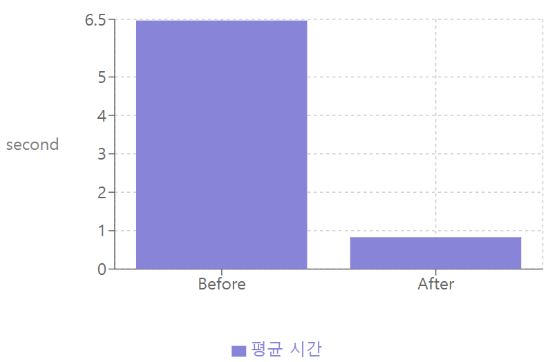
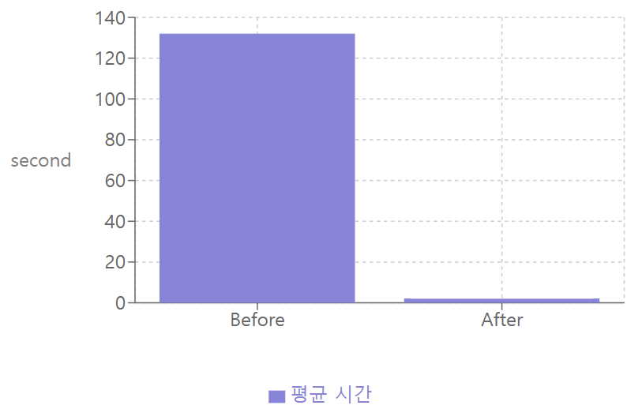
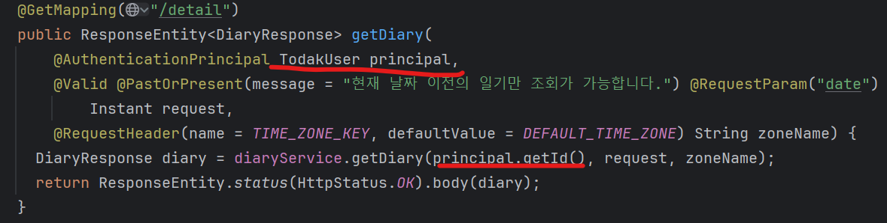
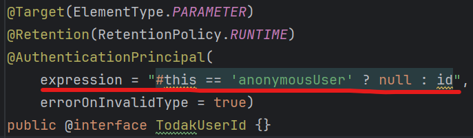

# todaktodak-api

토닥토닥 서비스의 API

# 담당 업무

## 성능 개선

### 1. 공개 일기 무한 스크롤 API  최적화

#### 문제

부하 테스트(500 VU, 5만개의 공개일기)시 평균 응답이 __6.47s__ 로 매우 느림

#### 해결

- DB Index 활용
- Redis 캐싱

#### 결과

- 평균 응답시간 6.47s에서 __0.83s__ 로 최적화

### 2. AI 서버 Webhook 통신 구현

#### 문제

일기 작성시, 웹툰(1분 30초), BGM(40초), 위로 코멘트(2초) 생성을 위해 오랜 시간이 소요됨

#### 해결

- 컨텐츠(웹툰/BGM,위로 코멘트) 별 비동기 요청 적용
- Webhook 통신 구현

#### 결과

- 일기 작성시 약 2분 12초의 대기 시간을 위로 코멘트 생성 시간 대기(__2초__)만으로 최적화
- AI 서버에서 컨텐츠 생성 완료시 API 서버에게 Request를 보냄.

- 콘텐츠를 생성하는 동안 클라이언트는 페이지간 이동이 자유롭게 가능하여 사용자 경험 개선

### 개발 편의성 개선

#### 문제

- 반복적인 getId() 메서드 발생
- 
  

#### 해결

- 커스텀 에노테이션 생성 및 SpEL 활용
- 
  

#### 결과

- 18개의 반복적인 코드 제거