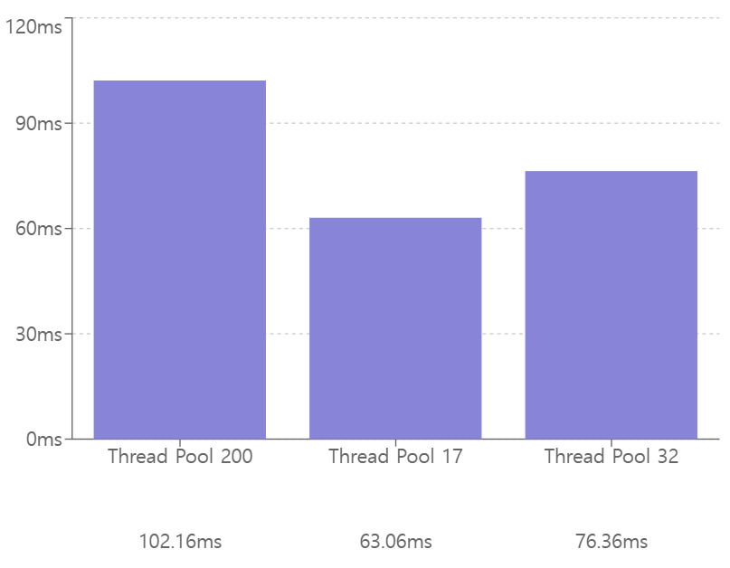

# todaktodak-api

## 📋 프로젝트 소개
- SNS로 하여금 사용자에게 **긍정적인 정서 경험**을 제공하고자 Todaktodak 서비스를 개발
- 사용자들의 일기를 바탕으로 AI가 __위로의 메시지__ 와 __웹툰__ , __BGM__ 을 제공하는 서비스

### 핵심 기능
- 사용자 캐릭터 생성 (화풍 : 로맨스 OR 디즈니)
- 일기 작성(웹툰,BGM,위로 메시지 생성)
- 공개 일기 무한 스크롤

## 담당 업무 - 풀스택(백엔드)

### 기술 스택 : 
- SpringBoot
- Spring Security
- JPA
- PostgreSql
- Redis 

## 성능 개선

### 1. 공개 일기 무한 스크롤 API 최적화 (DB Index, Redis 적용 및 Thread Pool 조정)
#### 문제 1 - DB Index 적용

- 부하 테스트 진행 : `10만 개`의 공개일기 및 `1초당 100개의 Request, 5분간 진행` (총 3만 개의 Request)
- 평균 응답이 <u>__30.71s__</u> 로 매우 느림

 부하 테스트 결과 Table

| sql    | avg | max | p95 |
|--------|-----|-----|-----|
| 1차     | 30.01s | 44.99s | 34.20s |
| 2차     | 30.67s | 46.62s | 34.33s |
| 3차     | 31.44s | 46.96s | 34.81s |
| **평균** | **30.71s** | **46.19s** | **34.45s** |

 

#### 원인 분석

- 하나의 SQL에 <u>**2번의 JOIN**</u>이 발생하여 많은 응답 시간이 소요됨

#### 해결 과정
- SQL은 `1.created_time` , `2.public_diary_Id` 를 기준으로 탐색을 시도함
- 두 컬럼에 대한 <u>**DB Index를 설정**</u>하여 쿼리 속도 개선 시도

#### 결과

- 평균 응답시간 <u>**30.71s에서 33.97ms로 99.89%**</u> 최적화

 DB Index 적용 부하 테스트 결과 Table

| DB Index | avg | max | p95 |
|----------|-----|-----|-----|
| 1차       | 34.71ms | 1.01s | 38.24ms |
| 2차       | 33.71ms | 75.45ms | 41.74ms |
| 3차       | 33.49ms | 74.39ms | 40.68ms |
| **평균**   | **33.97ms** | **386.61ms** | **40.22ms** |

    

 

#### 문제 2 - Redis 적용

- 2배 부하 테스트 진행 : `10만 개`의 공개일기 및 `1초당 200개의 Request, 5분간 진행` (총 <u>6만 개</u>의 Request)
- 평균 응답이 <u>__3.40s__</u> 로 느림

 2배 부하테스트 결과 Table

| timeUnit5 | avg | max | p95 |
|------|-----|-----|-----|
| 1차 | 3.87s | 10.23s | 5.56s |
| 2차 | 3.11s | 8.11s | 5.18s |
| 3차 | 3.22s | 8.62s | 5.19s |
| **평균** | **3.40s** | **8.99s** | **5.31s** |

#### 원인 분석
- 여전히 쿼리에 대한 결과를 가져오는 것에 많은 시간이 필요함

#### 해결 과정
 - Redis를 캐시로 적용 **(Look Aside)**
 - 캐시 데이터 TTL 5분 설정
 - 새로운 `Entity`에 `일기 내용`과 `리액션 개수`를 담아서 Redis에 저장
   - 문제 발생 1: Redis에서 <u>**한 번의 `read` 명령**</u>을 통해 <u>**2가지 조건**</u> (1.Timestamp , 2.Id)을 바탕으로 결과를 가져와야 한다
   - 해결 과정 1: 
     - ZSET 데이터 구조에 `SCORE는 모두 0`으로 설정
     - `Entity`의 `orderPivot` 이라는 필드에 `Timestam:Id` 와 같이 <u>**1.Timestamp, 2.Id 순으로 정렬**</u>이 가능하게끔 설정
   - 문제 발생 2: PostgreSQL 에서는 Id가 숫자로 정렬(100 > 2) 되지만, Redis의 ZSET은 Id가 문자열로 정렬("100" < "2") 된다
   - 해결 과정 2: 
     - Id 앞에 <u>**0으로 패딩 처리**</u> (이 때, Id는 Long 타입이기 때문에 최대 19 자리를 0으로 패딩 처리)
     - ex) `"orderPivot" : "1736126560306:0000000000000069486"`
#### 결과
 - `일기 내용`과 `리액션 개수`를 구하는 SQL 결과를 합쳐 Redis에 저장
 - Postgre SQL의 공개 일기 정렬 순서와, Redis의 공개 일기 **정렬 순서 일치**
 - 평균 응답시간 <u>**3.40s에서 638.55ms로 81.22%**</u> 최적화

Redis 적용 부하테스트 결과 Table

| redis  | avg | max | p95 |
|--------|-----|-----|-----|
| 1차     | 261.51ms | 1.71s | 636.82ms |
| 2차     | 324.13ms | 2.35s | 793.64ms |
| 3차     | 1.33s | 5.34s | 2.72s |
| **평균** | **638.55ms** | **3.13s** | **1.38s** |

#### 문제3 - Thread Pool 조정
- API의 <u>**최대 응답 속도**</u>가 평균 <u>**3.13s**</u> 으로 느림.

#### 원인 분석
- SpringBoot의 기본 Thread Pool 설정은 200
- 200개의 Thread가 <u>**Context Switch를 하여 많은 시간 소요**</u> 발생

#### 해결 과정
- 로컬 PC는 16개의 CPU를 보유하고 있음.
- Thread Pool을 16개로 설정.

#### 결과
- `최대 응답 속도`는 <u>**3.13s 에서 768.70ms로 75.44%**</u> 최적화
- `평균 응답 속도` 또한 <u>**638.55ms 에서 98.42ms로 84.58%**</u> 최적화

Thread Pool 조정 부하테스트 결과 Table

| thread pool | avg | max | p95 |
|-------------|-----|-----|-----|
| 1차          | 73.98ms | 1.01s | 146.92ms |
| 2차          | 64.24ms | 357.02ms | 146.59ms |
| 3차          | 157.05ms | 942.08ms | 694.75ms |
| **평균**      | **98.42ms** | **769.70ms** | **329.42ms** |

### 2. AI 서버 비동기 Callback 통신으로 컨텐츠 생성 시간 최적화

#### 문제

- 일기 작성시, 웹툰(1분 30초), BGM(40초), 위로 메시지(2초) <u>**생성을 위해 오랜 시간(약 2분 12초)**</u>이 소요됨
- 클라이언트는 일기 작성 후, 컨텐츠 생성이 완료되는 동안 <u>**웹 페이지를 벗어날 수 없음**</u>

#### 원인 분석

- WAS (Spring)는 AI 서버에게 컨텐츠 생성을 요청하고, <u>**생성 결과를 끝까지 기다린 뒤에 클라이언트에게 응답함**</u>

#### 해결 과정

- 컨텐츠(웹툰/BGM) 생성시 <u>**비동기 요청**</u>을 적용
- 위로 메시지는 응답 시간(약 2초)이 빠르다고 판단하여, <u>**동기 요청 적용 및 즉시 클라이언트에게 응답**</u>
- AI 서버는 컨텐츠(웹툰/BGM) 생성 완료시, WAS(Spring) 에게 `HTTP`의 `POST` 메서드로 <u>**컨텐츠 생성 완료 요청**</u>을 보냄
- WAS는 결과를 DB에 저장

#### 결과
- 일기 작성시 약 <u>**2분 12초의 대기 시간**</u>을 위로 코멘트 생성 시간 대기(<u>__2초__</u>)만으로 <u>**98.48%**</u> 최적화
- 콘텐츠를 생성하는 동안 <u>**클라이언트는 페이지간 이동이 자유롭게 가능**</u>하여 사용자 경험 개선

#### 추가 개선점
- 일기 작성 후, 실제 2초를 기다려 보니 체감이 상당히 길었음
- 위로 메시지 또한 **비동기 요청 및 Callback** 방식으로 전환이 필요  

### 개발 편의성 개선

#### 문제

- 18번의 반복적인 getId() 메서드 발생

#### 해결 과정

- `@AuthenticationPrincipal` 에노테이션을 활용한, <u>**커스텀 에노테이션 생성 및 SpEL 활용**</u>  
 
  

#### 결과

- 18개의 반복적인 코드 제거  

 

  