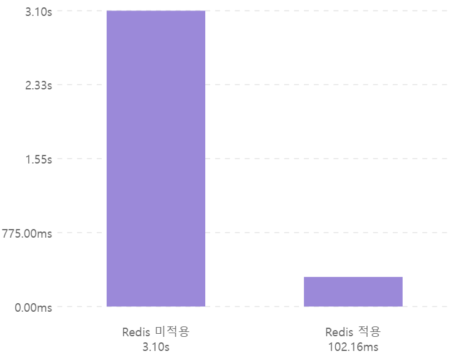

# todaktodak-api

## 📋 프로젝트 소개

- SNS로 하여금 사용자에게 **긍정적인 정서 경험**을 제공하고자 Todaktodak 서비스를 개발
- 사용자들의 일기를 바탕으로 AI가 __위로 메시지__ 와 __4컷 웹툰__ , __15초 BGM__ 을 제공하는 서비스

### 핵심 기능

- 사용자 캐릭터 생성 (화풍 : 로맨스 OR 디즈니)
- 일기 작성(4컷 웹툰,15초 BGM,위로 메시지 생성)
- 공개 일기 무한 스크롤

## ERD

### 현재 (25.01.31)


### 추후 개발 예정

- 일기방 및 초대 기능 추가 예정  
  

## 담당 업무 - 풀스택(백엔드)

### 기술 스택 :

- Java 21
- SpringBoot
- Spring Security
- JPA
- MySql
- Redis

## 성능 개선

### 1. 공개 일기 무한 스크롤 API 최적화 (DB Index, Redis, Thread Pool 활용)

부하 테스트에 대한 설정은 아래와 같다.

1. Local PC (Window10 / vCPU = 16) 에서 진행한다.
2. `k6` 부하테스트 도구를 활용 하였다.
    - k6는 Go 언어로 만들어 져서 **최소한의 리소스로 많은 부하**를 줄 수 있다.
    - 현재 테스트는 하나의 PC에서 부하를 발생 시키고 이에 대한 API 응답을 해야한다.
    - 따라서 API의 성능을 최대한으로 이끌어 내기 위해 K6 를 선택했다.
3. **API 응답 Latency 시간을 측정**한다.
4. 응답 시간 기준은 **개인적으로 답답함을 느끼는 시간**을 기준으로 정하였다.

- 응답 시간 기준

  | avg < 1s | p(95) < 2s | max < 3s|
  |---------|------------|---------|

<br> 

### 1차 최적화 - DB Index 적용

- 부하 테스트 진행 : `10만 개`의 공개일기 대상으로 `1초당 100개의 API Request, 5분간 진행` (총 <u>3만 개</u>의 Request)
- 평균 응답이 <u>__30.71s__</u> 로 매우 느림

<details>
<summary>
 부하 테스트 결과 Table
</summary>

| sql    | avg        | max        | p95        |
|--------|------------|------------|------------|
| 1차     | 30.01s     | 44.99s     | 34.20s     |
| 2차     | 30.67s     | 46.62s     | 34.33s     |
| 3차     | 31.44s     | 46.96s     | 34.81s     |
| **평균** | **30.71s** | **46.19s** | **34.45s** |

</details>

<br>

#### 원인 분석

- MySql 실행 계획을 확인한 결과, **SQL 하나에 약 143ms**가 소요됨
- 또한 2번의 Join 과정에서 **Table Full Scan이 발생**하여 많은 응답 시간이 소요됨

#### 해결 과정

- SQL은 `1.created_time` , `2.public_diary_Id` 를 기준으로 탐색을 시도함
- 두 컬럼에 대한 <u>**DB Index를 설정**</u>하여 쿼리 속도 개선 시도

#### 결과

- MySql 실행 계획은 약 0.5ms로 최적화
- 평균 응답시간 <u>**30.71s에서 33.97ms로 99.89%**</u> 최적화

<details>
<summary>
 DB Index 적용 부하 테스트 결과 Table
</summary>

| DB Index | avg         | max          | p95         |
|----------|-------------|--------------|-------------|
| 1차       | 34.71ms     | 1.01s        | 38.24ms     |
| 2차       | 33.71ms     | 75.45ms      | 41.74ms     |
| 3차       | 33.49ms     | 74.39ms      | 40.68ms     |
| **평균**   | **33.97ms** | **386.61ms** | **40.22ms** |

</details>

<br>   


<br>

### 2차 최적화 - Redis 적용

- 2배 부하 테스트 진행 : `10만 개`의 공개일기 대상으로 `1초당 200개의 API Request, 5분간 진행` (총 <u>6만 개</u>의 Request)
- 평균 응답이 <u>__3.10s__</u> 로 느림

<details>
<summary>
 2배 부하테스트 결과 Table
</summary>

| Redis 미적용 | avg       | max       | p95       |
|-----------|-----------|-----------|-----------|
| 1차        | 2.61s     | 7.55s     | 5.43s     |
| 2차        | 4.15s     | 8.29s     | 5.39s     |
| 3차        | 3.46s     | 10.34s    | 5.35s     |
| 4차        | 1.17s     | 6.79s     | 4.72s     |
| 5차        | 4.11s     | 10.21s    | 5.33s     |
| **평균**    | **3.10s** | **8.64s** | **5.24s** |

</details>

#### 원인 분석

- API 한 번 요청에 5개의 공개 일기 내용을 가져옴
- `일기 내용 5개` 획득 SQL 1번, `리액션 개수` 획득 SQL 5번, `사용자가 클릭한 리액션 정보` 획득 SQL 5번, **총 11번의 쿼리 발생**

#### 해결 과정

- Redis를 캐시로 적용 **(Look Aside)**
- 캐시 데이터 TTL 5분 설정
- 새로운 `Entity`에 `일기 내용`과 `리액션 개수`를 필드에 넣고, Json으로 Redis에 저장 (6개의 SQL 결과를 Redis에 저장)
    - 문제 발생 1: Redis에서 <u>**한 번의 `read` 명령**</u>을 통해 <u>**2가지 조건**</u> (1.Timestamp , 2.Id)을 바탕으로
      결과를 가져와야 함
    - 해결 과정 1:
        - ZSET 데이터 구조에 `SCORE는 모두 0`으로 설정
        - `Entity`의 `orderPivot` 이라는 필드에 `Timestam:Id` 와 같이 <u>**1.Timestamp, 2.Id 순으로 정렬**</u>이
          가능하게끔 설정
    - 문제 발생 2: RDBMS와 Redis의 정렬 기준에 차이가 발생
        - RDBMS는 Id가 숫자로 정렬(100 > 2) 되지만, Redis의 ZSET은 Id가 문자열로 정렬("100" < "2")
    - 해결 과정 2:
        - Redis에 저장할 때 Id 앞에 <u>**0으로 패딩 처리**</u>
            - 이 때, Id는 Long 타입이기 때문에 최대 19 자리를 0으로 패딩 처리
            - ex) `"orderPivot" : "1736126560306:0000000000000069486"`

#### 결과

- `일기 내용`과 `리액션 개수`를 구하는 **SQL 결과(6개의 SQL)를 합쳐 Redis에 저장**
- RDBMS 공개 일기 정렬 순서와, Redis 공개 일기 **정렬 순서 일치**
- 평균 응답시간 <u>**3.10s에서 102.16ms로 96.70%**</u> 최적화

<details>
<summary>
Redis 적용 부하테스트 결과 Table
</summary>

| Redis 적용 | avg          | max       | p95          |
|----------|--------------|-----------|--------------|
| 1차       | 64.33ms      | 1.33s     | 138.86ms     |
| 2차       | 68.32ms      | 723.98ms  | 175.63ms     |
| 3차       | 109.17ms     | 898.71ms  | 377.24ms     |
| 4차       | 57.47ms      | 383.68ms  | 100.17ms     |
| 5차       | 211.50ms     | 2.95s     | 868.05ms     |
| **평균**   | **102.16ms** | **1.26s** | **332.00ms** |

</details>



<br>

### 추가 최적화 - Thread Pool 조정

> Redis를 적용한 API 응답 시간은 기준 내에 들기 때문에 문제가 될 것은 없다.  
> 그러나 추가적으로 성능을 개선할 수 있는 방법이 있어. Thread Pool을 조정하여 성능 개선을 시도했다.
> - Spring Boot는 기본적으로 Thread Pool의 Thread Max를 200개로 설정한다.
> - Thread가 너무 많으면 잦은 Cpu Context Switch로 인해 성능 저하가 발생할 수 있다.
> - Local PC는 vCPU 16개를 가지고 있어. 이를 기준으로 Goetz의 Thread Pool 공식에 따라 측정을 했다.
> - 현재 서버가 명확하게 Cpu , I/O Bound 중 어디에 해당하는지 감이 잡히지 않아 둘 다 테스트를 했다.
> - Thread가 생성되는 시간을 제거하기 위하여, Thread Max와 Min 을 동일하게 설정했다.

#### 1. Cpu Bound - Number of cores + 1

- `Thread 17개`로 설정하여 테스트를 진행했다.

<details>
<summary>
`Thread 17 부하테스트 결과 Table
</summary>

| Thread 17 | avg         | max          | p95          |
|-----------|-------------|--------------|--------------|
| 1차        | 65.02ms     | 844.1ms      | 121.26ms     |
| 2차        | 63.91ms     | 278.01ms     | 122.24ms     |
| 3차        | 67.63ms     | 515.77ms     | 211.49ms     |
| 4차        | 51.02ms     | 168.24ms     | 85.42ms      |
| 5차        | 67.71ms     | 461.84ms     | 183.78ms     |
| **평균**    | **63.06ms** | **453.59ms** | **144.84ms** |

</details>

#### 2. I/O Bound - Number of cores * (1 + Wait time / Service time)

- **임의적**으로 `Thread 32개`로 설정하여 테스트를 진행했다.
    - Wait time과 Service time 측정에 시간을 사용하기 보다는, 먼저 **서버가 I/O Bound임을 가정**하였다.
    - 만약 서버가 I/O Bound인 경우, **Cpu Bound 보다 많은 Thread를 설정했을 때 성능이 더 높을 것으로 예상**한다.

<details>
<summary>
Thread 32 부하테스트 결과 Table
</summary>

| Thread 32 | avg         | max          | p95          |
|-----------|-------------|--------------|--------------|
| 1차        | 76.74ms     | 1.14s        | 193.47ms     |
| 2차        | 62.67ms     | 455.74ms     | 113.69ms     |
| 3차        | 56.24ms     | 428.98ms     | 87.66ms      |
| 4차        | 54.2ms      | 270.9ms      | 82ms         |
| 5차        | 131.95ms    | 1.23s        | 780.15ms     |
| **평균**    | **76.36ms** | **705.12ms** | **251.39ms** |

</details>

#### 결과

| Thread | avg         | max          | p95          |
|--------|-------------|--------------|--------------|
| **17** | **63.06ms** | **453.59ms** | **144.84ms** |
| 32     | 76.36ms     | 705.12ms     | 251.39ms     |

- `Thread 17`로 설정했을 때가 모든 값에서 좋은 성능을 보인다.
- **서버는 Cpu Bound 작업**을 위주로 하고 있으며, Thread Pool 조정을 통해 추가 성능을 개선 하였다.
- `평균 응답 속도`는 <u>**102.16ms 에서 63.06ms로 38.27%**</u> 최적화
- `최대 응답 속도` 또한 <u>**1.26s 에서 453.59ms로 64.00%**</u> 최적화


### 2. AI 서버 비동기 Callback 통신으로 컨텐츠 생성 시간 최적화

#### 문제

- 일기 작성시, 웹툰(1분 30초), BGM(40초), 위로 메시지(2초) <u>**생성을 위해 오랜 시간(약 2분 12초)**</u>이 소요됨
- 클라이언트는 일기 작성 후, 컨텐츠 생성이 완료되는 동안 <u>**웹 페이지를 벗어날 수 없음**</u>

#### 원인 분석

- WAS (Spring)는 AI 서버에게 컨텐츠 생성을 요청하고, <u>**생성 결과를 끝까지 기다린 뒤에 클라이언트에게 응답함**</u>

#### 해결 과정

- 컨텐츠(웹툰/BGM) 생성시 `WebClient`를 이용한 <u>**비동기 요청**</u>을 적용
- 위로 메시지는 응답 시간(약 2초)이 빠르다고 판단하여, <u>**동기 요청 적용 및 즉시 클라이언트에게 응답**</u>
- AI 서버는 컨텐츠(웹툰/BGM) 생성 완료시, WAS(Spring) 에게 `HTTP`의 `POST` 메서드로 <u>**컨텐츠 생성 완료 요청(callback)**</u>을 보냄
- WAS는 결과를 DB에 저장

#### 결과

- 일기 작성시 약 <u>**2분 12초(132초)의 대기 시간**</u>을 위로 코멘트 생성 시간 대기(<u>__2초__</u>)만으로 <u>**98.48%**</u> 최적화
- 콘텐츠를 생성하는 동안 <u>**클라이언트는 페이지간 이동이 자유롭게 가능**</u>하여 사용자 경험 개선


#### 추가 개선점

- 일기 작성 후, 실제 2초를 기다려 보니 체감이 상당히 길었음.
- 위로 메시지 또한 **비동기 요청 및 Callback** 방식으로 전환이 필요.

---

## 개발 편의성 개선

### 1. 인증 객체의 getId() 값을 Controller에 자동 전달

#### 문제

- 18번의 반복적인 getId() 메서드 발생


#### 해결 과정

- `@AuthenticationPrincipal` 에노테이션을 활용한, <u>**커스텀 에노테이션 생성 및 SpEL 활용**</u>  
  <br>
  

#### 결과

- 18개의 반복적인 코드 제거

<br>

  

### 2. Commit 메시지에 Jira Issue 번호 작성 자동화

#### 문제

- Commit Message 컨벤션에 의해 Message의 1번 줄 가장 오른쪽에 Jira Issue 번호 작성 필요

#### 해결 과정

- `.git/hooks/commit-msg` 파일에 `Shell` 스크립트 작성
- Branch 이름에 있는 Jira Issue 번호를 가져와 Commit시 Message에 번호 작성 자동화

#### 결과

- Jira Issue 번호를 신경쓰지 않고 편하게 Commit 가능

<details>
<summary>
Shell Script
</summary>

```shell
#!/bin/sh
#
# Get the current branch name
BRANCH_NAME=$(git symbolic-ref --short HEAD)

# Extract project ID from branch name (e.g., 'todak4' from 'feature/todak4/auth')
PROJECT_ID=$(echo $BRANCH_NAME | sed -n 's/.*\/\([^/]*\)\/.*/\1/p')

# Convert PROJECT_ID to uppercase
PROJECT_ID=$(echo "$PROJECT_ID" | tr '[:lower:]' '[:upper:]')

# Read the commit message from the file
commit_msg_file=$1
commit_source=$2
sha1=$3

# Function to insert project ID at the end of the first line
insert_project_id() {
    # Read the first line
    first_line=$(head -n 1 "$commit_msg_file")
    # Read the rest of the lines
    rest_of_msg=$(tail -n +2 "$commit_msg_file")

    # Append project ID to the first line
    modified_first_line="$first_line $PROJECT_ID"

    # Write the modified first line and the rest of the message back to the file
    echo "$modified_first_line" > "$commit_msg_file"
    if [ -n "$rest_of_msg" ]; then
        echo "$rest_of_msg" >> "$commit_msg_file"
    fi
}

# Check if the commit message already contains the project ID
if [ -n "$PROJECT_ID" ] && ! grep -qiF "$PROJECT_ID" "$commit_msg_file"; then
    insert_project_id
fi
```

</details>

---

## 고려한 점

### 1. JPA Projection 과 Covering Index를 활용하여 DB 조회시 비용 감소

- 한 달간의 일기 작성 현황 정보를 API로 제공하기 위하여 아래와 같이 조치를 취함
    - Diary Table에 `1.Member Id`, `2.CreatedTime`에 대한 DB Index 생성
    - 위의 2가지 조건으로 `Select` 할 때, Diary Table의 `Id`와 `Diary_Created_Time`만을 `Select` 하는 `Interface Projection` 활용

### 2. JPA Cascade Delete 설정시 연관된 객체 수 만큼 쿼리가 발생하여, DB Cascade Delete 설정

- `공개 일기` 삭제시, 연관된 `일기 반응(Reaction)`을 삭제하는 DB Cascade Delete 설정
    - `공개 일기`와 `일기 반응`은 양방향 연결 관계이기에, `공개 일기`에 JPA Cascade Delete를 설정한 후 삭제를 하면 `일기 반응` 개수
      만큼 Delete 쿼리가 발생하는 문제가 생겨 DB Cascade로 변경
    - 그러나 10만개, 100만개의 `일기 반응` Cascade Delete가 발생하면 DB에 부담이 가기에, 추후에 **Batch와 Soft Delete를 활용하여 삭제** 구현 예정

### 3. 동료와 Junit 기반으로 237개의 테스트 코드를 작성하여 Instruction Test Coverage 70% 기록

- Google 에서 제안한 일반적인 Test Coverage를 기준으로 목표치 60% 이상 설정
    - https://edykim.com/ko/post/code-coverage-best-practices/
- 237개 중, **158개의 테스트 코드 작성**

### 4. @SpringBootTest를 사용한 테스트의 Spring Context를 캐싱하여 테스트 시간 최적화

- 총 5개의 Spring Context 캐싱 진행
- Gradle의 clean build 시간을 **76s → 58s로 23%** 최적화
